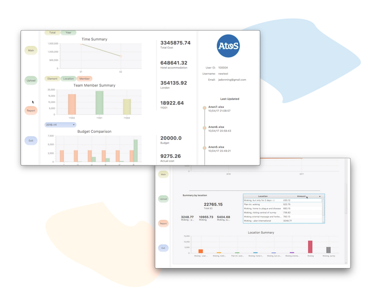

# README

## Quick overview 

[Video demo 1](https://drive.google.com/file/d/1Tf5S7BkxvXtzKuC4AoLmNLPe-m87Q9V9/view?usp=sharing)

[Video demo 2](https://drive.google.com/file/d/1auBNiIVwq8UYYonqe9d8jUaDnQDjSfjL/view?usp=sharing)

## General Info

Git link:

**Now at: https://github.com/zequnyu/TravelDashboard**

https://projects.cs.nott.ac.uk/psyzy5/G52GRP_TEAM19_2016_Beliebers

Google Drives link:
https://drive.google.com/drive/folders/0B09zzUIA23jnM05qREMwX0dQaWs?usp=sharing

Trello link:

Backend Development- https://trello.com/b/6nidMYtv/backend
Frontend Development- https://trello.com/b/gDCIeEvn/design
Test- https://trello.com/b/nelg3eGp/test
Meetings- https://trello.com/b/Bvt1NQ5E/meeting
Documentations- https://trello.com/b/tjUe2eIq/documentation

Third-party libraries that were used in the project:

-	MySQL connector, licensed under the GPL license.
Access from: https://dev.mysql.com/downloads/connector/j/
-	Apache POI, licensed under the Apache License, Version 2.0.
Access from: https://poi.apache.org
-	Apache PDFBox, licensed under the Apache License, Version 2.0.
Access from: https://pdfbox.apache.org
-	JUnit, licensed under the Eclipse Public License 1.0.
Access from: http://junit.org/junit4/
